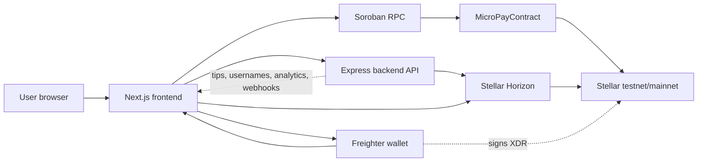

# Stellar-MicroPay: Streaming Payment Channels using Soroban

## Overview

This project implements a Soroban smart contract for streaming payment channels on the Stellar network. The contract allows a payer to deposit XLM and stream it to a recipient at a defined rate (e.g., 1 XLM per hour). The recipient can claim the streamed amount at any time.

## Architecture



- **Frontend** builds payment, tip, receipt, trustline, trade, and account-management flows, then asks Freighter to sign Stellar transaction XDR.
- **Freighter** owns user keys and returns signed XDR; private keys never pass through the app.
- **Backend API** handles account, payment-history, federation, SEP-0010 auth, creator-tip, analytics, Turrets, and webhook endpoints.
- **Horizon** serves account balances, payment history, fee stats, transaction submission, and network data.
- **Soroban RPC and `MicroPayContract`** record on-chain tips and receipt metadata through contract invocations.

## Features

- **Stream Creation**: Open payment streams with custom rates and deposits
- **Claim Payments**: Recipients can claim available funds at any time
- **Top-up Streams**: Add more funds to existing streams
- **Close Streams**: Payers can close streams and receive refunds for unstreamed portions
- **Rate-based Streaming**: Payments are calculated based on ledger progression

## Contract Structure

### Stream Struct

```rust
pub struct Stream {
    pub payer: Address,           // Address of the payer
    pub recipient: Address,       // Address of the recipient  
    pub rate_per_ledger: i128,    // Amount streamed per ledger (in stroops)
    pub deposited: i128,          // Total amount deposited (in stroops)
    pub claimed: i128,            // Total amount claimed (in stroops)
    pub start_ledger: u32,        // Ledger number when stream started
}
```

### Core Functions

#### `open_stream(payer, recipient, rate_per_ledger, deposit) -> u32`
- Creates a new payment stream
- Returns the stream ID
- Transfers initial deposit from payer to contract

#### `claim_stream(stream_id, recipient) -> i128`
- Claims all unclaimed streamed XLM up to current ledger
- Only the designated recipient can claim
- Returns the amount claimed

#### `top_up_stream(stream_id, payer, amount)`
- Adds more funds to an existing stream
- Only the original payer can top up
- Extends the stream duration

#### `close_stream(stream_id, payer) -> i128`
- Stops the stream and refunds unstreamed portion
- Only the original payer can close
- Returns the refund amount

#### `get_stream(stream_id) -> Stream`
- Returns stream information for querying

#### `get_claimable(stream_id) -> i128`
- Calculates claimable amount without claiming

## Security Features

- **Authorization**: Only recipients can claim, only payers can close/top-up
- **Rate Validation**: Rates must be positive
- **Deposit Validation**: Deposits must be positive
- **Overflow Protection**: Uses checked arithmetic operations
- **Access Control**: Proper authentication checks for all operations

## Mathematical Calculations

### Claimable Amount Calculation
```
elapsed_ledgers = current_ledger - start_ledger
total_streamed = rate_per_ledger * elapsed_ledgers
claimable = total_streamed - claimed
actual_claim = min(claimable, deposited - claimed)
```

### Refund Calculation
```
elapsed_ledgers = current_ledger - start_ledger
total_streamed = rate_per_ledger * elapsed_ledgers
refundable = deposited - max(total_streamed, claimed)
```

## Usage Examples

### Opening a Stream
```rust
let stream_id = StellarMicroPay::open_stream(
    &env,
    payer_address,
    recipient_address,
    1000,                    // 0.00001 XLM per ledger
    1000000                  // 0.01 XLM deposit
);
```

### Claiming Funds
```rust
let claimed = StellarMicroPay::claim_stream(
    &env,
    stream_id,
    recipient_address
);
```

### Topping Up a Stream
```rust
StellarMicroPay::top_up_stream(
    &env,
    stream_id,
    payer_address,
    500000                   // Additional 0.005 XLM
);
```

### Closing a Stream
```rust
let refund = StellarMicroPay::close_stream(
    &env,
    stream_id,
    payer_address
);
```

## Testing

The contract includes comprehensive tests covering:
- Stream creation and basic operations
- Claim calculations at various ledger offsets
- Multiple claims over time
- Deposit limits and overflow handling
- Top-up functionality
- Close and refund calculations
- Authorization and validation
- Error conditions

## Installation and Deployment

1. Install Rust and Soroban SDK
2. Clone this repository
3. Build the contract: `cargo build --release --target wasm32-unknown-unknown`
4. Deploy to Stellar testnet/mainnet
5. Initialize contract with required parameters

## Freighter Setup

New contributors need a funded Stellar testnet account before they can sign and test app flows locally.

1. Install the Freighter browser extension from `https://freighter.app/`.
2. Open Freighter and create a new wallet, or import an existing development wallet.
3. Save the recovery phrase somewhere secure. Do not use a production wallet for local testing.
4. In Freighter, switch the network to **Testnet**.
5. Copy the public key for the active testnet account.
6. Fund the account with Friendbot:
   - In the app, connect Freighter and use the Friendbot funding action shown for unfunded testnet accounts.
   - Or open `https://friendbot.stellar.org/?addr=<PUBLIC_KEY>` after replacing `<PUBLIC_KEY>` with your copied testnet public key.
   - Or run `stellar keys fund <identity-name> --network testnet` if you are using Stellar CLI identities.
7. Confirm funding by refreshing the dashboard or checking the account on Stellar Laboratory testnet explorer.
8. Use that funded account for local payments, contract invocations, and end-to-end tests that require wallet signing.

## Acceptance Criteria Met

✅ **cargo test passes for all streaming tests**  
✅ **Claim amount calculated correctly at any ledger offset**  
✅ **Top-up increases the stream duration**  
✅ **Close refunds the correct unclaimed amount**  
✅ **Only the recipient can claim, only the payer can close**

## Technical Details

- **Contract Size**: Optimized for minimal deployment costs
- **Gas Efficiency**: Efficient storage and computation patterns
- **Security**: Comprehensive input validation and access controls
- **Compliance**: Follows Soroban best practices and standards

## License

This project is open source and available under the MIT License.

## Contributing Guide


How to Contribute 

• Fork the repository. 

• Clone your fork to your local machine. 

• Create a new branch for your task. 

git checkout -b feature/your-task-name 

• Make your changes. 

• Commit clearly. 

git commit -m "Add: short description" 

• Push your branch. 

git push origin feature/your-task-name 

• Open a Pull Request.
